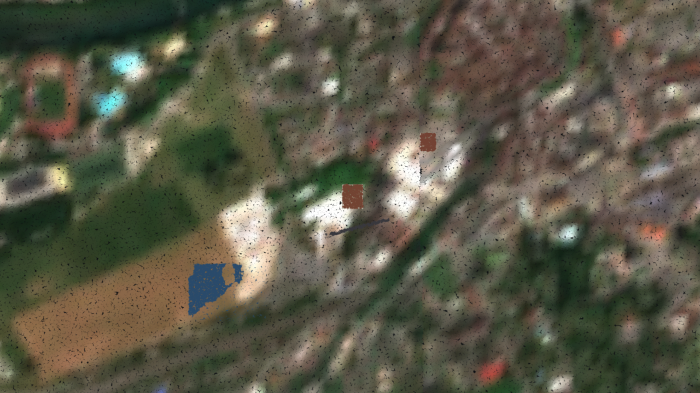

# The pilot region, compiled by a browser tab



Three z14 tiles of the pilot — 8.03–8.06 °E, 47.38–47.40 °N, the Aare valley
east of Aarau — seen from 900 m up in `play.html`. Everything in the picture was
produced by one browser tab and published through PostgREST; the server computed
none of it (Invariant 9).

What is on screen, and where it came from:

- the **ground**, from the seeded Copernicus GLO-30 DEM, with the seeded
  Sentinel-2 imagery draped over it and blended by slope (`assemble-v1`);
- the **two buildings** — brown roofs, one gabled and one flat — extruded from
  the OSM footprints in `feature`, with their heights from `props`;
- the **pond**, laid flat at the lowest ground under its ring;
- the **forest**, scattered with seeded Poisson-disk trees, and the **road**,
  cut into the terrain and surfaced;
- 800 000 gaussians per tile, sampled from those surfaces at the tile's whole
  budget by `sample-v1`, encoded by `sog-v1` and streamed back by the viewer.

## Reproducing it

```sh
set -a; . ./.env; set +a
bash tools/seed-dem.sh && bash tools/seed-ortho.sh
OSM_FILE=infra/seed/pilot-fixture.osm bash tools/seed-osm.sh
make client-test                       # publishes the WP1 test tiles too
PILOT_BLOCK=1 npx playwright test client/test/e2e/pilot-block.spec.js
```

The spec opens `play.html`, turns the work panel on, calls `ensure_job` for
every z14 tile the world has inside one z12 block and then for the four rungs
above it, waits for each to be published, and finally flies the viewer over the
result and writes this picture. Each z14 tile is about twenty seconds of work:
assemble, sample, encode, upload, publish.

`client/test/e2e/pilot.spec.js` is the same thing in the gate, cut down to one
z14 tile and its ancestors so `make gate` stays a few minutes long.

## What the viewer will and will not refine into

The streamer stops at the coarsest tile whose children are not all published: a
child with no `tile` row is ground nobody has drawn on and is not a hole, but a
row that exists and is unpublished is one, and refining into it would tear the
ground open. Compiling a whole z12 block is therefore what unlocks z14 in the
viewer — which is what the picture above shows.
